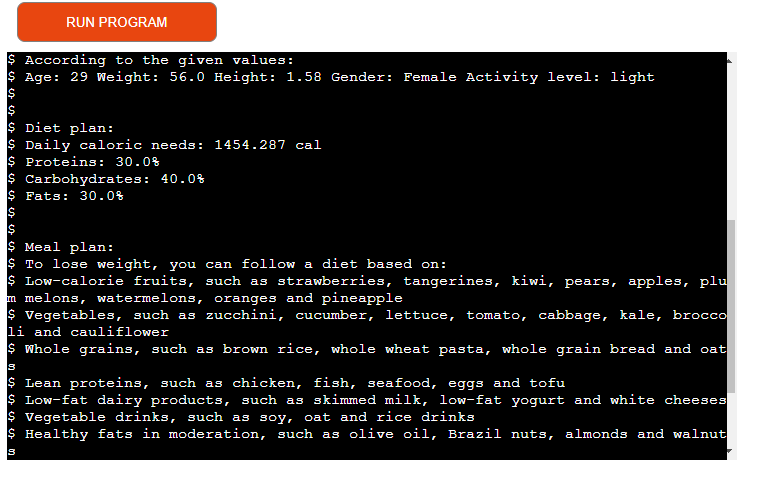

# Your Health

Calculate your diet according to your goal.

- [Your Health-Live page](https://your-health-1e58ffa00d71.herokuapp.com/)

## Overview

This project aims to assist users in determining their dietary needs based on various factors such as age, weight, height, gender, and activity level. It provides functions to calculate caloric needs, determine macronutrient distribution, validate user inputs, generate meal plans, and analyze data from a Google Sheets document.

## Prerequisites

Before running the code, ensure you have the following dependencies installed:

- [gspread](https://gspread.readthedocs.io/en/latest/)
- [oauth2client](https://oauth2client.readthedocs.io/en/latest/)
- [pprint](https://docs.python.org/3/library/pprint.html)
- [colorama](https://pypi.org/project/colorama/)

You also need to set up authentication with Google Sheets API and provide the necessary credentials (`creds.json`).

## Usage

1. Run the script.
2. Follow the prompts to enter your age, weight, height, gender, activity level, and goal.
3. The script will calculate your daily caloric needs, display macronutrient distribution, suggest a meal plan based on your goal, and provide insights based on data analysis.

## Functions

### `calculate_caloric_needs(age, weight, height, gender, activity_level)`

Calculates caloric needs based on the Harris-Benedict Equation.

### `macronutrient_distribution(objective)`

Calculates macronutrient distribution based on the user's goal.

### `validate_age(age)`

Validates the user's age input.

### `validate_weight(weight)`

Validates the user's weight input.

### `validate_height(height)`

Validates the user's height input.

### `validate_gender(gender)`

Validates the user's gender input.

### `validate_activity_level(activity_level)`

Validates the user's activity level input.

### `validate_objective(objective)`

Validates the user's goal input.

### `meal_plan(objective)`

Generates a meal plan based on the user's goal.

### `update_your_health_worksheet(gender_column_name, age_column_name, objective_column_name)`

Updates the Your Health worksheet with new user data.

### `count_gender(sheet, column_name)`

Counts occurrences of genders (M and F) in a specific column of the worksheet.

### `count_objective(sheet, column_name)`

Counts occurrences of objectives (weight loss, muscle mass gain, maintenance) in a specific column of the worksheet.

## Function Testing Summary

The table below summarizes the behavior of each function in the code and whether they passed or failed the tests:

| Function                    | Behavior                                           | Pass/Fail |
|-----------------------------|----------------------------------------------------|-----------|
| calculate_caloric_needs    | Calculates caloric needs based on given parameters | Pass      |
| macronutrient_distribution | Calculates macronutrient distribution              | Pass      |
| validate_age                | Validates the user's age input                     | Pass      |
| validate_weight             | Validates the user's weight input                  | Pass      |
| validate_height             | Validates the user's height input                  | Pass      |
| validate_gender             | Validates the user's gender input                  | Pass      |
| validate_activity_level     | Validates the user's activity level input          | Pass      |
| validate_objective          | Validates the user's goal input                    | Pass      |
| meal_plan                   | Generates a meal plan based on the user's goal     | Pass      |
| update_your_health_worksheet| Updates the Your Health worksheet with new data    | Pass      |
| count_gender                | Counts occurrences of genders in a specific column  | Pass      |
| count_objective             | Counts occurrences of objectives in a specific column | Pass      |
| All functions tested        | All functions behave as expected                   | Pass      |

This table provides a clear overview of each function's behavior and the outcome of the tests conducted.

## Issues

During the project I had some difficulties with functions that did not work correctly
This was fixed by changing the scope of the variables.
The "$" symbol shown in the Heroku template is not written in the code.

## Unresolved problems

After some mentoring, I was advised to use a library to color the text, but this did not happen with the text in the mock up, a lot of research was done on the internet and including a tutoring where we tried to use different libraries and different versions of the programs, none of which attempted to solve the defect worked, not even the tutoring was able to help with the resolution.

## Future Functionality

Below are potential features that could be implemented in future updates of the code:

- **Customized Meal Plans:** Develop a feature that generates personalized meal plans based on the user's dietary preferences, restrictions, and health goals.

- **Export Data:** Implement functionality to allow users to export their health data in various formats (e.g., CSV, PDF) for further analysis or sharing with healthcare professionals.

- **Feedback System:** Incorporate a feedback system to gather user feedback and suggestions for improving the application.

These are just a few ideas for potential enhancements to the codebase that could improve the user experience and functionality of the application.

## Contributing

The template models were taken from the Love Sandwiches project by Code Institute.

The codes to access Google Spreadsheets were made according to the content of the course and the Code Institute's Love Sandwiches project

